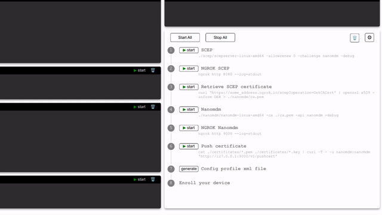

# Nanostarter
UI helper tool for [Nanomdm](https://github.com/micromdm/nanomdm) quickstart with SCEP server and Ngrok


## Notes for using with default Nanostarter configs
* Download release archive and unpack
* Copy your Apple *.pem and *.key certificate files to ./certificates folder
* Copy your SCEP server files to ./scep folder
* Copy your Nanomdm binary to ./nanomdm folder

### Starting Nanostarter
* In terminal
```
$ ./nanostarter-darwin-amd64
```
* Open your browser on default address http://localhost:8085
* Press "Start All" button
* If all configs are correct you should see all green labels, except "Enroll your device"
* Enroll.mobileconfig configuration file will be downloaded automatically
* Apply your new configuration
* Now you should see your device ID after "Enroll your device" label
* Enjoy your testing and playing with Nanomdm!

### Using Nanostarter with custom address
```
$ ./nanostarter-darwin-amd64 -addr :3000
```
* Open your browser on custom address http://localhost:3000

### Embed mode
By default, App's embed mode is enabled. All the client built code client/dist will be embedded
into the Golang binary.
You need nothing to change, just be sure when building binary to use make command:
```
$ make my
```

### Disabled Embed mode "-embed false"
This mode is appropriate in dev mode. Golang will serve static folder client/dist
```
$ go run . -embed false
```
You don't need to build you frontend with "npm run build", but you can:
```
$ cd ./client
$ npm run dev
```
Open client on http://localhost:3000

Other necessary steps to run in -embed=false:
* be sure to run App in default address :8085
* in non-Linux systems, make changes in ./client/index.html :
```
window.__GOOS__ = "linux";
window.__GOARCH__ = "amd64";
```
to:
```
window.__GOOS__ = "darwin";
window.__GOARCH__ = "arm64"; //if not amd64
```
The changes above are not crucial, but the default Nanomdm & SCEP commands will be correct.

### Fast start in dev mode client and server
Open terminal and type to start in dev mode client

`make dev_c`

Open another terminal and type to start in dev mode server

`make dev_s`

### Configure "Steps" commands
<p align="center">
  
</p>

* Click ⚙ button
* Make changes to the "Steps" command
* Click the "Save" button
  The changes will be saved to the browser's local storage.
  So next time you'll start App it'll persist.

To restore default values, click the "Defaults" button in the "Configs" section and save changes.
Also, you can clean local storage in the browser's dev console.

## Project structure
### server
The Go-backend task is simple - executing commands from the client and maintaining a connection.
* Websocket connections - for logging commands
* /command HTTP endpoint - for simple commands.
  
If the websocket connection closes, the connected command initiator also stops.
And vice-versa, the command stops - connection closes.

### client
We have eight steps(tasks) to rich our goal - device enrollment https://github.com/sheshenia/nanostarter/blob/main/client/src/models/cmd_defaults.js

The steps where we need logs - are "terminal" tasks.

Some tasks need data from logs, like Ngrok URL or topic ID.
For such data, I've added watchers in
[terminals: addWatchersToNgrok(), addWatchersToNanomdm()](https://github.com/sheshenia/nanostarter/blob/main/client/src/components/Terminal.vue)

Watcher's task is simple - when the Terminal-Step's log changes, try to parse the last incoming log and find the data it needs with regex.
[Founded data are stored in Vue-pinia "store" (notifications and enrollmentIDs)](https://github.com/sheshenia/nanostarter/blob/main/client/src/stores/commands.js)

Now back to [cmd_defaults.js](https://github.com/sheshenia/nanostarter/blob/main/client/src/models/cmd_defaults.js) where we define our steps. You can find in some of them the stepAction function (store), which takes our Vue-pinia "store" as an argument and grabs the data it needs from there.