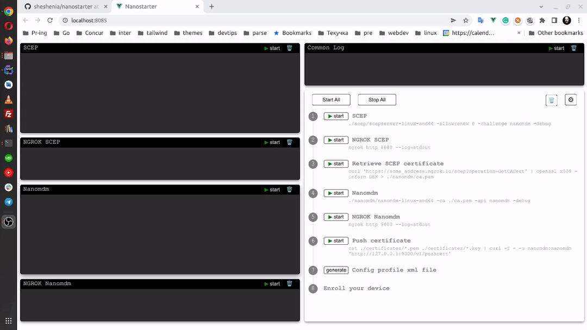

# Nanostarter
UI helper tool for [Nanomdm](https://github.com/micromdm/nanomdm) quickstart with SCEP server and Ngrok


## Notes for using with default Nanostarter configs
* Download release archive and unpack
* Copy your Apple *.pem and *.key certificate files to ./certificates folder
* Copy your SCEP server files to ./scep folder
* Copy your Nanomdm binary to ./nanomdm folder

### Starting Nanostarter
* In terminal
```
$ ./nanostarter-darwin-amd64
```
* Open your browser on default address http://localhost:8085
* Press "Start All" button
* If all configs are correct you should see all green labels, except "Enroll your device"
* Enroll.mobileconfig configuration file will be downloaded automatically
* Apply your new configuration
* Now you should see your device ID after "Enroll your device" label
* Enjoy your testing and playing with Nanomdm!


### Using Nanostarter with custom address
```
$ ./nanostarter-darwin-amd64 -addr :3000
```
* Open your browser on custom address http://localhost:3000
